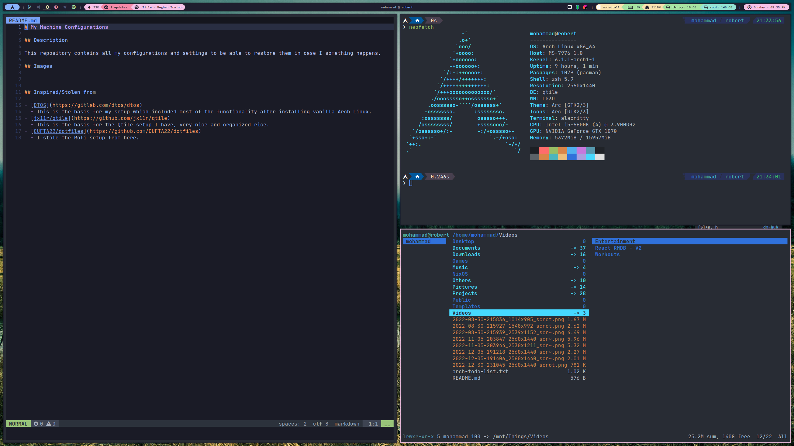

# .dotfiles

## Screenshots

## Inspired/Stolen from

- [DTOS](https://gitlab.com/dtos/dtos)
  - This is the basis for my setup which included most of the functionality after installing vanilla Arch Linux.
- [jx11r/qtile](https://github.com/jx11r/qtile)
  - This is the basis for the Qtile setup I have, very nice and organized rice.
- [CUFTA22/dotfiles](https://github.com/CUFTA22/dotfiles)
  - I stole the Rofi setup from there.
